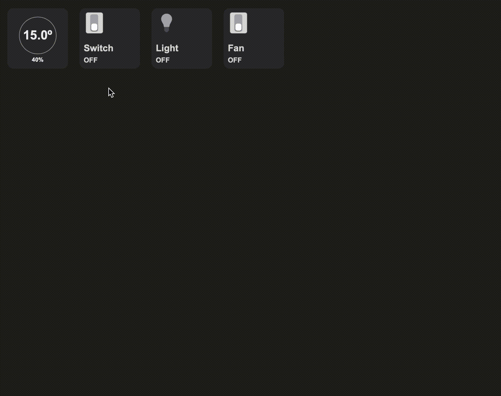

# HomeAutomationWebUI

A series of UI building blocks that can be used for building html based smarthome UI interface. Think about iOS Home app in html.

It will be continously updated for more UI building blocks.

Documentation is not available at this moment. You can check `example.html` and `scripts/example.js` on how to use those UI blocks.